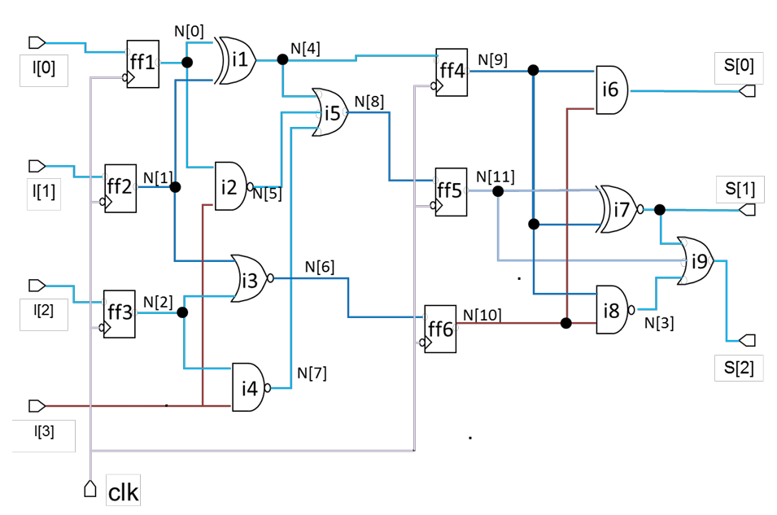

# Event-Driven Simulation in VLSI Design

## Overview
This README provides an overview of event-driven simulation techniques used in Very Large Scale Integration (VLSI) design. Event-driven simulation is a fundamental approach for verifying digital circuits and predicting their behavior.

## Background
- **Interpreted Simulators**: These simulators utilize parser-generated databases to perform simulations. The process involves reading the circuit netlist, dynamically creating data structures in memory, and simulating the circuit based on user-supplied input vectors.
- **Compiled Code Simulators**: In these simulators, all gates are evaluated once for each input vector. However, if an input of a gate remains unchanged, its output remains the same, eliminating the need for re-simulation. This optimization improves simulation speed.
- **Event-Driven Scheduling**: Interpreted simulators use an event-driven scheduling algorithm. Its main function is to detect events (such as input changes) and schedule gate simulations accordingly. If no events occur, no gates are simulated.

## Simulation Flow
1. **Circuit Description**: The circuit netlist is read by a parser, and appropriate data structures are created in memory.
2. **Simulation Kernel**: A separate simulation kernel operates on the data structures. It uses information from library models and processes user-supplied input vectors.
3. **Gate Evaluation**: Gates are evaluated based on scheduled events. Current node values (computed in the previous time slot) are used.
4. **Unit Delay Model**: Changes in net values occur one unit of time later. New events are scheduled for processing in the next time unit.
5. **Time Units**: Simulated time units can vary arbitrarily between successive input vectors.

## Data Structures

### 1. Event
- Represents an event in the simulation (e.g., an update or evaluation event for a node).
- Contains the following information:
  - Node: The affected node.
  - Event type: Update or evaluation.
  - Value: The value associated with the event.

### 2. EventQueue
- Manages a queue of events.
- Operations:
  - Insert: Add an event to the queue.
  - Remove: Remove an event from the queue.
  - Find: Locate events in the queue.
  - Print: Display the event queue.

### 3. GateQueue
- Manages a queue of gates in the circuit.
- Contains:
  - A map of gate names to gate types.
- Operations:
  - Simulate gates: Perform gate simulations.
  - Print gate queue: Display gate information.

### 4. NetTableEntry
- Represents an entry in the net table, storing information about each net (node) in the circuit.
- Contains:
  - Current value: The current state of the net.
  - New value: The updated value after an event.
  - Initialization value: Initial value of the net.
  - Node: The net/node identifier.
  - Fanout gates: Gates connected to this net.

### 5. NetTable
- Manages a table of net entries.
- Operations:
  - Find: Retrieve net entries.
  - Update: Modify net values.
  - Print: Display net information.

### 6. EventDrivenSim
- The main simulation class.
- Responsibilities:
  - Manages event and gate queues.
  - Handles the net table.
  - Generates VCD (Value Change Dump) files.
  - Orchestrates the simulation process.
  - Initializes nodes, processes events and gates, and simulates input vectors.

## Handling Flip-Flops in Event-Driven Simulation

The event-driven simulator can handle flip-flops (DFFs) implemented as primitive cells or also with their internal logic.
The DFF implemented in a simplified version, and includes in both versions the ports CLK, D, Q alone. 

### Primitive DFFs:

Implement DFF behavior directly (using stdcell.v from ISCAS-85).

### Gate-Level Implementation of DFF:

Includes gates composing the DFF’s functionality (using stdcell_FF.v).
DFF is no longer a black box; its internal structure is explicitly defined and handle loops within the DFF structure.

## How to Run

### Build:
From Logic-CAD directory, run `make`.\
From Event_Driven_Sim directory, run `make`.

### Generate VCD:
#### - Using Perimitive DFF:
* `./event_sim TopLevel2806 tests/c2806.sig.txt tests/c2806.vec.txt stdcell.v tests/c2806.v`
* `./event_sim TopLevel3540 tests/c3540.sig.txt tests/c3540.vec.txt stdcell.v tests/c3540.v`
* `./event_sim shiftReg tests/shiftReg.sig.txt tests/shiftReg.vec.txt stdcell.v tests/shiftReg.v`
* `./event_sim shiftRegDifCLK tests/shiftRegDifCLK.sig.txt tests/shiftRegDifCLK.vec.txt stdcell.v tests/shiftRegDifCLK.v`

#### - Using Level-Gate Implementation DFF:
* `./event_sim TopLevel2806 tests/c2806.sig.txt tests/c2806.vec.txt stdcell_DFF.v tests/c2806.v`
* `./event_sim TopLevel3540 tests/c3540.sig.txt tests/c3540.vec.txt stdcell_DFF.v tests/c3540.v`
* `./event_sim shiftReg tests/shiftReg.sig.txt tests/shiftReg.vec.txt stdcell_DFF.v tests/shiftReg.v`
* `./event_sim shiftRegDifCLK tests/shiftRegDifCLK.sig.txt tests/shiftRegDifCLK.vec.txt stdcell_DFF.v tests/shiftRegDifCLK.v`

## Example
Circuit c2806.v implementation:

Once you generated the VCD file you can use the built in WaveTrace Extension in Visual Studio code to view. For the input vector of c2806.v, the output VCD file is:

### Notes
Please note that the event-driven simulator described in this README is limited to specific primitive cells and may not support all types of input circuits. If you require more information or have specific questions about the simulator's capabilities, please feel free to contact me.
